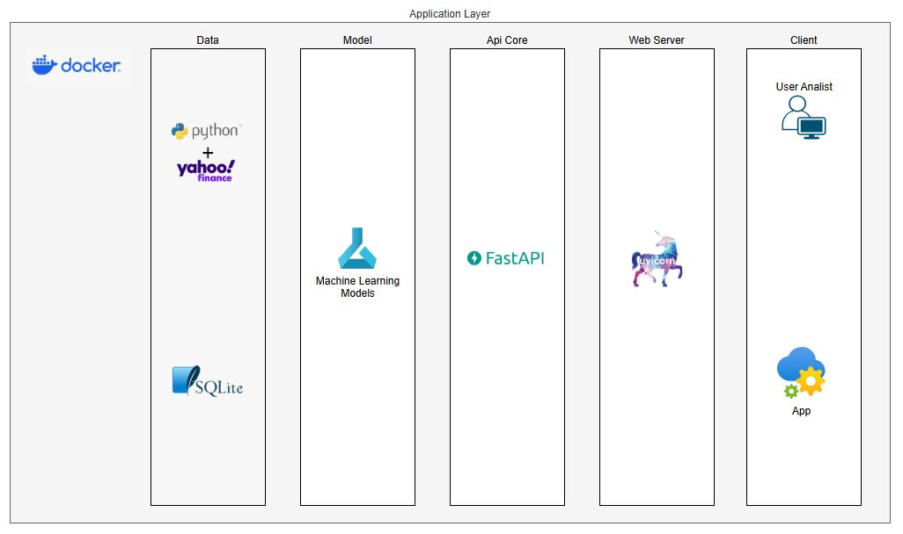
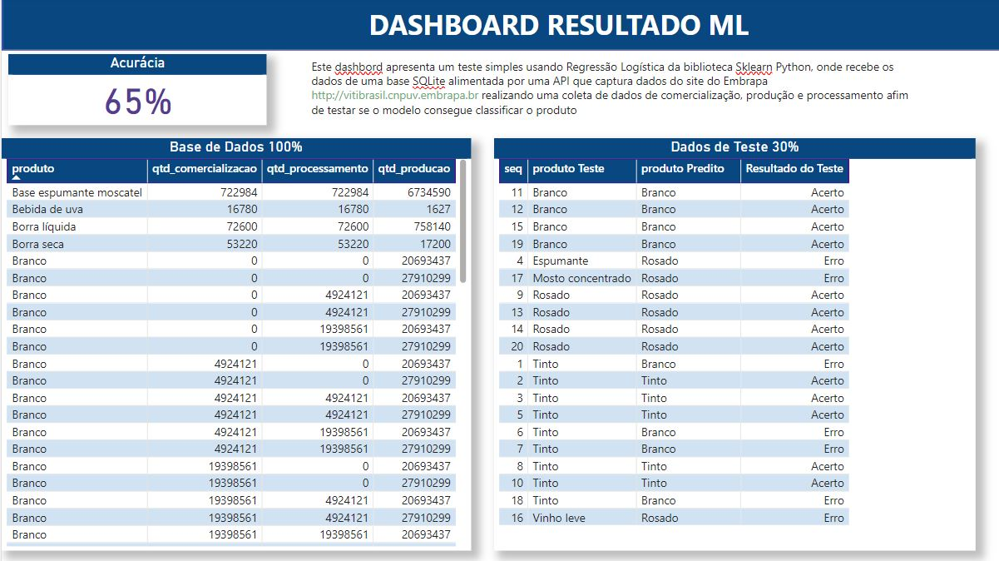

# Tech Challeng FIAP 
> API - Criar uma api para treinar um modelo LSTM utilizando dados financeiros
> do Yfinance Yahoo


## Objetivo? 
> Disponibilizar uma api para realizar o treino e obter o resultado do modelo.


## Links e Repositórios do Projeto
[Git Hub Project](https://github.com/naldolima/embrapa_api)

[Video Explicativo](https://youtu.be/DVCTuCq1edU)


## Tecnologias Utilizadas:
* Python
* FastAPI
* Uvicorn (server)
* Sqlalchemy
* Sqlite
* Jwt
* Yfinance
* AutoLSTM
* Docker

## Arquitetura do Projeto:


## Como fazer o download e iniciar a aplicação ?
```
git clone https://github.com/naldolima/embrapa_api.git
cd .\api_finance\backend
docker build -t api_finance .
visit  127.0.0.1:8000/
```
## Como autenticar com o user admin ?

Via Login:
> * Com a aplicação iniciada acesse http://127.0.0.1:8000/docs
> * clique no botão Authorize
> * Entre com user: user@teste.com e password: xdlE!@LKdabi

Gerar Token:
> * Com a aplicação iniciada acesse http://127.0.0.1:8000/docs
> * acesse http://127.0.0.1:8000/docs#/login/login_for_access_token_token_post
> * clique no botão "Try it out"
> * Entre com username: user@teste.com e password: xdlE!@LKdabi
> * Em seguida clique no botão "Execute"
> * Pronto! seu token foi gerando no response da requisição
 
Utilizar o Token:
> Escolha uma ferramenta de requisição de sua preferencia, 
> como por exemplo: "Postman", e faça uma requisição GET com os 
> seguintes parametros:
> * Escolha o método GET
> * Url: http://127.0.0.1:8000/treinar_modelo
> * Na opção Authorization ajuste as opções: 
> Type: OAuth 2.0, Current token: coloque o token gerado conforme 
> passo anterior, Header Prefix: Bearer

## Como ajustar os parametros do modelo?
```
cd .\backend\core\config.py

 # Parametros do Modelo LSTM
 
 DT_START_TRAIN:  str = '2024-06-01' # data de inicio do treino
 DT_END_TRAIN: str = '2024-09-30' # data de final do treino
 DT_START_VALID: str = '2024-10-01' # data de inicio da validacao
 DT_END_VALID: str = '2024-10-31' # data do fim da validacao
 NUM_EXAMPLES: int = 1 # numero de exemplos para o modelo treinar
 VAL_SIZE: int = 30 # dias para validação 


```


Temas abordados:
 - ✔️ Serving Template
 - ✔️ Connecting to Database
 - ✔️ Schemas
 - ✔️ Dependency Injection
 - ✔️ Password Hashing
 - ✔️ Authentication login/create user/get token
 - ✔️ Authorization/Permissions
 - ✔️ LSTM